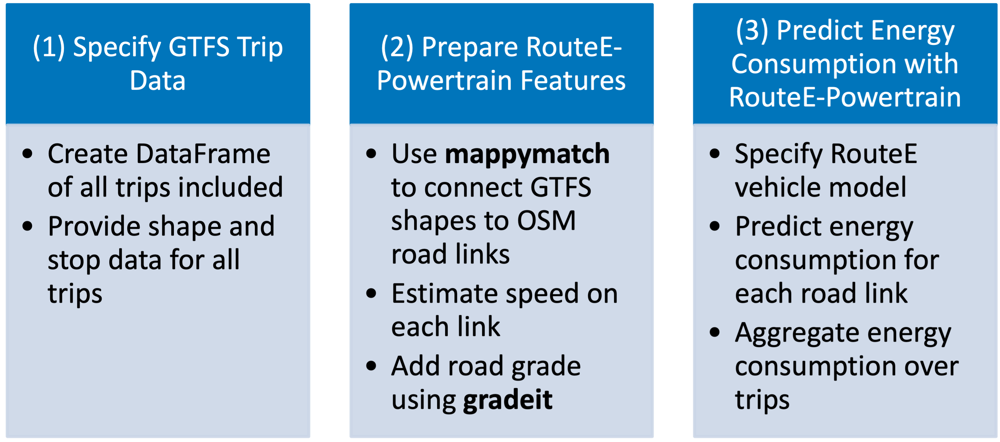

# RouteE-Transit Prediction Pipeline
RouteE-Transit builds on [RouteE-Powertrain](https://github.com/NREL/routee-powertrain) to predict the energy consumption of bus trips given a static GTFS feed. Its key role is to convert GTFS features (such as trip and shape data) into RouteE features (such as vehicle speed, road grade, and distance along road links), so that a RouteE-Powertrain model can be used to predict energy consumption. The full prediction pipeline is summarized by the following figure:



RouteE-Transit moves from static GTFS files to energy predictions in three steps:

## 1) Specify GTFS Trip Data
First, users need to specify the scope of predictions by supplying data from a static GTFS feed. See [](data:gtfs-reqs) for details on what GTFS data must be available. RouteE-Transit needs a set of trips along with their shape traces, stop locations, and stop times in order to proce estimated distance, road grade, and speed for RouteE-Powertrain models.

Users can supply an entire GTFS feed as input or filter down trips (e.g., only trips on a certain day or serving a certain route).

## 2) Prepare RouteE-Powertrain Features
Next, RouteE-Transit transforms the input GTFS data into link-level features on the road network so a RouteE-Powertrain model can be applied. The first step in this process is to upsample the shape traces from `shapes.txt` to approximately 1 Hz resolution for better map matching accuracy, and then match the shapes to OpenStreetMap road links using NREL's `mappymatch` package.

The map-matched shapes are then used to calculate link distances and NREL's `gradeit` package appends road grade information to each link based on USGS National Map elevation data.

Finally, the estimated distances are used along with the time intervals between stops from`stop_times.txt` to estimate bus average speed along each road link.

## 3) Predict Energy Consumption with RouteE-Powertrain
In the last step, a trained RouteE-Powertrain model is run to predict energy consumption for each trip. RouteE-Powertrain version 1.3.2 introduced two initial transit bus models (`Transit_Bus_Diesel` and `Transit_Bus_Battery_Electric`) and additional models for different bus styles and manufacturers will be rolled out over time.

# Using the GTFSEnergyPredictor Class

RouteE-Transit provides an object-oriented interface through the `GTFSEnergyPredictor` class that simplifies the complete workflow:

```python
from nrel.routee.transit import GTFSEnergyPredictor

# Initialize predictor
predictor = GTFSEnergyPredictor(
    gtfs_path="path/to/gtfs",
    # depot_path is optional - defaults to NTD depot locations
)

# Option 1: Use the convenience method (recommended)
trip_results = predictor.run(
    vehicle_models="Transit_Bus_Battery_Electric",
    date="2023/08/02",
    routes=["205"],
    add_hvac=True,
)

# Option 2: Step-by-step processing for more control
predictor.load_gtfs_data()
predictor.filter_trips(date="2023/08/02", routes=["205"])
predictor.add_mid_block_deadhead()  # Between-trip deadhead
predictor.add_depot_deadhead()      # To/from depot (uses NTD locations)
predictor.match_shapes_to_network()
predictor.add_road_grade()
predictor.predict_energy(vehicle_models=["Transit_Bus_Battery_Electric"], add_hvac=True)
```

# Assumptions and Limitations
* **HVAC Energy**: Weather impacts are modeled through seasonal HVAC energy consumption (winter and summer) based on ambient temperature data from TMY3 files. Users can enable this with the `add_hvac=True` parameter.
* **Deadhead Trips**: Both mid-block deadhead trips (between consecutive revenue trips) and depot deadhead trips (pull-out/pull-in) can be included in the analysis using the `add_mid_block_deadhead()` and `add_depot_deadhead()` methods, or by setting the corresponding parameters to `True` in the `run()` method.
* **Depot Locations**: By default, depot locations come from the National Transit Database's "Public Transit Facilities and Stations - 2023" dataset (https://data.transportation.gov/stories/s/gd62-jzra). Users can provide custom depot locations by specifying `depot_path` when initializing the predictor.
* **Network Data**: By default, OpenStreetMap is used for road network matching. The class is designed to be extended for use with proprietary network data (e.g., TomTom, HERE) by subclassing and overriding the `_match_shapes_to_network()` method.