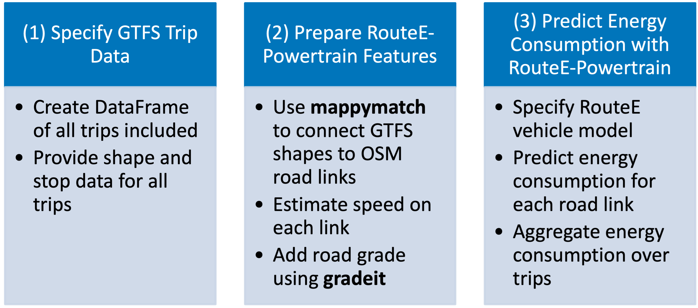

# RouteE-Transit Prediction Pipeline
RouteE-Transit uses [RouteE-Compass](https://github.com/NatLabRockies/routee-compass) to predict the energy consumption of bus trips given a static GTFS feed. Its key role is to convert GTFS features (such as trip and shape data) into road link-level features (speed, road grade, and distance), which RouteE-Compass then uses to predict energy consumption. The full prediction pipeline is summarized by the following figure:



RouteE-Transit moves from static GTFS files to energy predictions in three steps:

## 1) Specify GTFS Trip Data
First, users need to specify the scope of predictions by supplying data from a static GTFS feed. See [](data:gtfs-reqs) for details on what GTFS data must be available. RouteE-Transit needs a set of trips along with their shape traces, stop locations, and stop times in order to produce estimated distance, road grade, and speed for energy modeling.

Users can supply an entire GTFS feed as input or filter down trips (e.g., only trips on a certain day or serving a certain route).

## 2) Prepare Road Link Features
Next, RouteE-Transit transforms the input GTFS data into link-level features on the road network. Shape traces from `shapes.txt` are upsampled to approximately 1 Hz resolution, then map-matched to OpenStreetMap road links using RouteE-Compass's LCSS (Longest Common Subsequence) map matcher.

Road grade and elevation are appended to each matched link automatically by RouteE-Compass using OSMnx elevation data sourced from the USGS National Map. No separate elevation download step is required.

Finally, estimated distances are combined with the time intervals between stops from `stop_times.txt` to estimate average bus speed along each road link.

## 3) Predict Energy Consumption with RouteE-Compass
In the last step, RouteE-Compass — via a custom Rust extension bundled with RouteE-Transit — predicts energy consumption for each trip. Two transit bus models are included:

- `Transit_Bus_Battery_Electric` (kWh)
- `Transit_Bus_Diesel` (gallons_diesel)

Both models apply the road link features computed in step 2 and include a kinetic energy stop penalty at GTFS stop locations (modeled as ½mv²). Additional models may be added in future releases.

# Using the GTFSEnergyPredictor Class

RouteE-Transit provides an object-oriented interface through the `GTFSEnergyPredictor` class:

```python
from routee.transit import GTFSEnergyPredictor

# Initialize predictor — vehicle_models is set here
predictor = GTFSEnergyPredictor(
    gtfs_path="path/to/gtfs",
    vehicle_models=["Transit_Bus_Battery_Electric"],
    # depot_path is optional - defaults to NTD depot locations
)

# Option 1: Use the convenience method (recommended)
trip_results = predictor.run(
    date="2023/08/02",
    routes=["205"],
    add_hvac=True,
)

# Option 2: Step-by-step processing for more control
predictor.load_gtfs_data()
predictor.filter_trips(date="2023/08/02", routes=["205"])
predictor.add_mid_block_deadhead()  # Between-trip deadhead
predictor.add_depot_deadhead()      # To/from depot (uses NTD locations)
predictor.get_link_level_inputs()   # Map matching + grade via RouteE-Compass
predictor.predict_energy(add_hvac=True)
```

# Assumptions and Limitations
* **HVAC Energy**: Weather impacts are modeled through seasonal HVAC energy consumption (winter and summer) based on ambient temperature data from TMY3 files. Users can enable this with the `add_hvac=True` parameter.
* **Deadhead Trips**: Both mid-block deadhead trips (between consecutive revenue trips) and depot deadhead trips (pull-out/pull-in) can be included in the analysis using the `add_mid_block_deadhead()` and `add_depot_deadhead()` methods, or by setting the corresponding parameters to `True` in the `run()` method.
* **Depot Locations**: By default, depot locations come from the National Transit Database's "Public Transit Facilities and Stations - 2023" dataset (https://data.transportation.gov/stories/s/gd62-jzra). Users can provide custom depot locations by specifying `depot_path` when initializing the predictor.
* **Network Data**: By default, OpenStreetMap is used for road network matching. The class is designed to be extended for use with proprietary network data (e.g., TomTom, HERE) by subclassing and overriding the `_match_shapes_to_network()` method.
